<iframe width="560" height="315" src="https://www.youtube.com/embed/65jF9kK9jLU?si=_wVtdJQgO7L7HHjy" title="YouTube video player" frameborder="0" allow="accelerometer; autoplay; clipboard-write; encrypted-media; gyroscope; picture-in-picture; web-share" referrerpolicy="strict-origin-when-cross-origin" allowfullscreen></iframe>

## Context

This game was created during our two-year Master’s program by a team of ten, each contributing to every aspect of the project.

The playable version features about 45 minutes of gameplay and serves as the first level of our broader game concept. 
While time limitations and other challenges prevented us from completing the full game, this prototype demonstrates our some of our vision and ambition on a limited scale.



## Game Design

## Rigging & Skinning



All rigs in the project were created in Maya using the Advanced Skeleton plugin, which offers a free version for non-commercial projects.

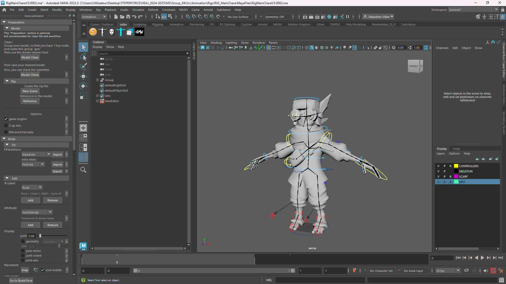
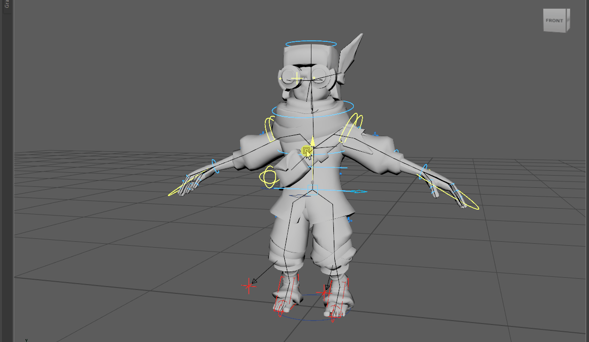

The rig went through several versions throughout the project, as I applied improvements and fixes over time, even though most of the core work was done in the first version.

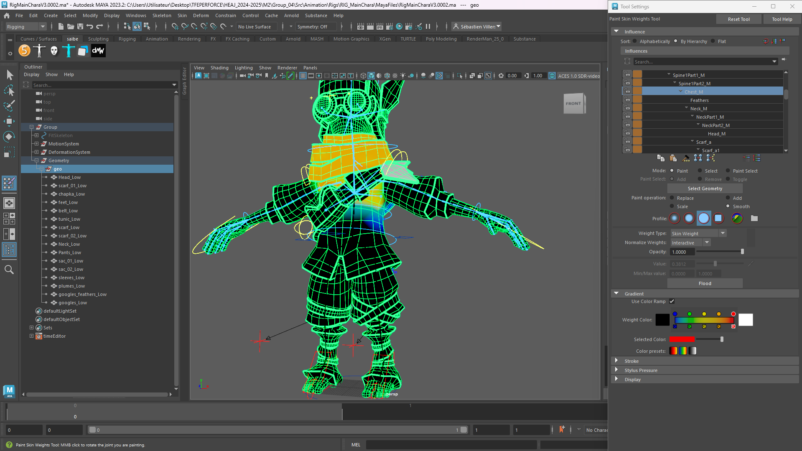

## 3D Animation & Tech Anim

<iframe width="560" height="315" src="https://www.youtube.com/embed/W0E7NPG32Rs?si=0JGEa4PFlqvOaqPR" title="YouTube video player" frameborder="0" allow="accelerometer; autoplay; clipboard-write; encrypted-media; gyroscope; picture-in-picture; web-share" referrerpolicy="strict-origin-when-cross-origin" allowfullscreen></iframe>

I worked on almost all the animations for the main character. We had another Game Animator in the team who worked on NPCs.

The animations were made with Autodesk Maya 2024 and integrated into Unreal Engine 5.

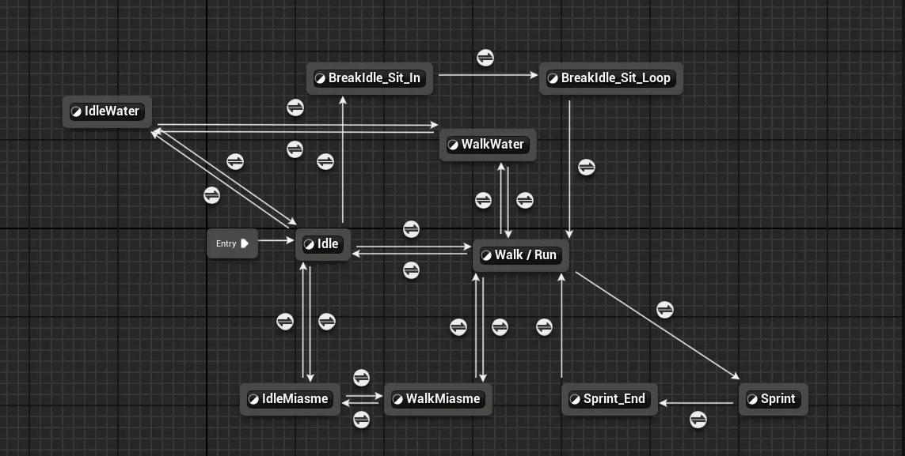

## Sound Design

<iframe width="560" height="315" src="https://www.youtube.com/embed/dOYja4VSejw?si=WjIiMZ6gMpZW6jcg" title="YouTube video player" frameborder="0" allow="accelerometer; autoplay; clipboard-write; encrypted-media; gyroscope; picture-in-picture; web-share" referrerpolicy="strict-origin-when-cross-origin" allowfullscreen></iframe>

### Footsteps integration

For the integration, the sounds were linked to animations. It was therefore necessary to create events at the right moments within the animation in Unreal.

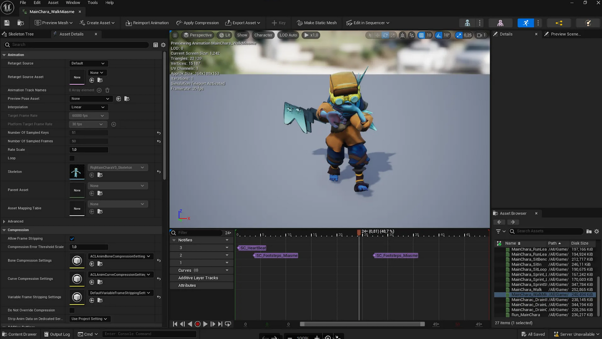

More complex were the footsteps and clothing sounds, which were all grouped into a single audio cue containing footsteps on different surfaces: dirt, stone, grass, and wood.

Before sending them to the output, a switch had to be added between different numeric values tied to a variable we called *Surface*.

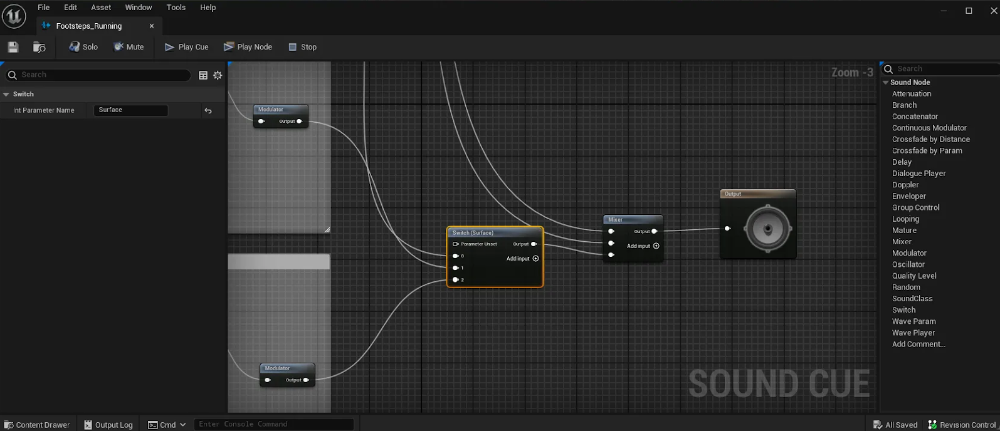

These numbers corresponded to Unreal’s surface types. After creating the appropriate Physics Materials for each sound and applying them in the Unreal settings, the footsteps could react depending on the surface the character was walking on.

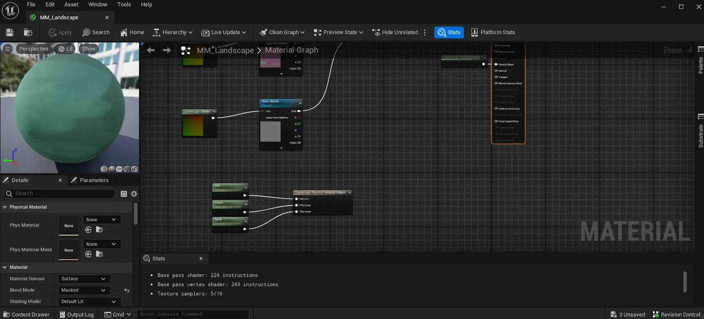

This Switch/Surface method is highly modular, as it allows you to progressively add new sounds for new terrains, which we did over the course of the project.

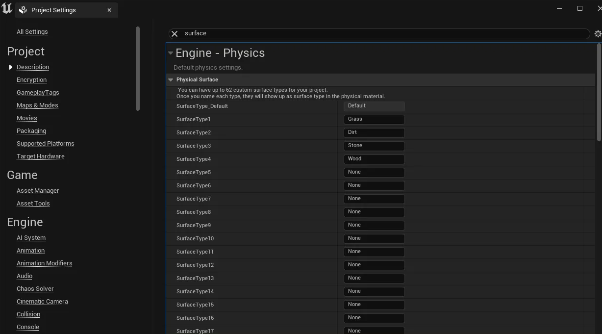

### Ambiences

For the ambiences, the goal was to have a natural and relaxing atmosphere outdoors, contrasted with a heavier atmosphere in the depths. They were created in Reaper, our DAW of choice for this thesis project, while the interiors were mostly refined during integration using effects like reverb (see the integration section).

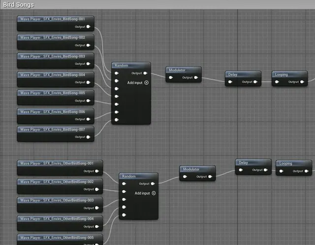

For the caves, I wanted to create a sense of discomfort, since our concept was to play on the dissonance of a disturbing cozy game.

To highlight this dissonance, the outdoors needed to feel warm and comforting, while the indoors had to be more unsettling. That required different ambiences and additional sounds, with a clear distinction between the two.

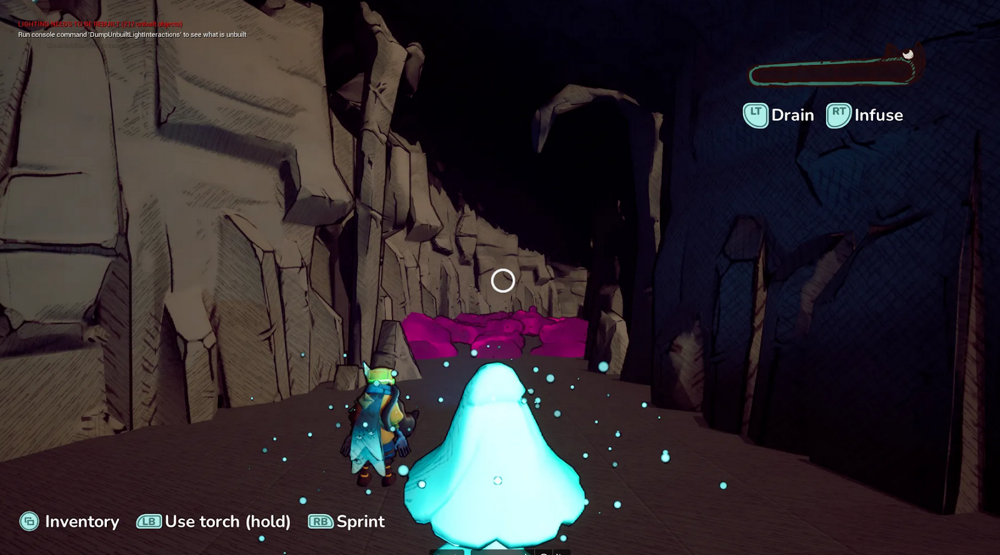

To make the caves feel more threatening and isolated, I deliberately avoided adding any creature sounds. I also used an Audio Volume with reverb, applied selectively thanks to sound class sorting (obviously I didn’t want reverb on music or UI sounds).

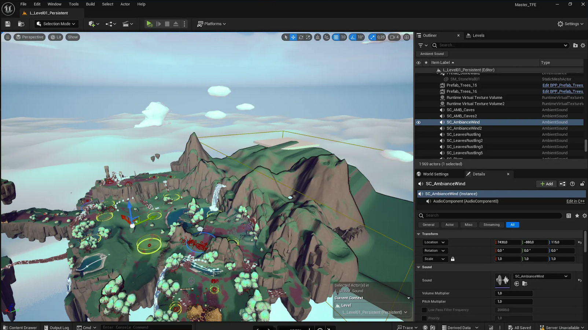

Meanwhile, outdoors, I wanted bird sound effects all around the player to create a sense of being surrounded by life.

### Music Integration

The game features three music tracks: one for the main menu, one for outdoor areas, and one for indoor areas.

Together with the composer, we were inspired by the approach used in *Minecraft*: the music often gives way to ambient sound and restarts randomly, making it less repetitive and more surprising.

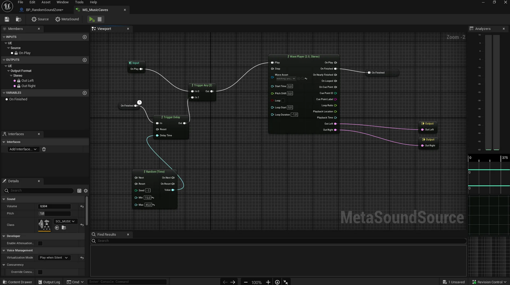

The system is extremely simple. It selects a random delay between two values, plays the music, and once finished, relaunches it after another delay.

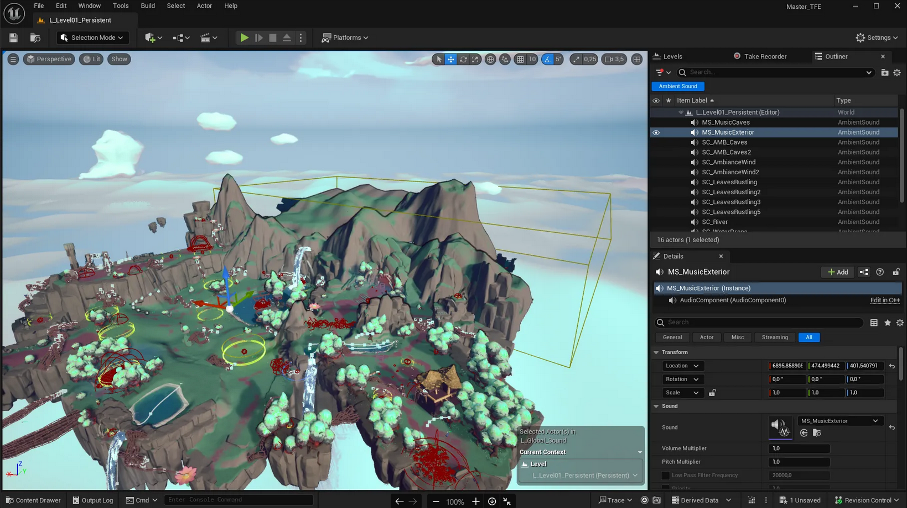

I also used the Audio Volumes already set up for ambiences so that outdoor music only plays outside, and indoor music only inside. 

### SFX

### Random Sound Zone

One effect I wanted to add in the caves to reinforce the unsettling atmosphere was a system that plays sounds randomly in 3D space around the player.

This system was implemented with the help of our programmer.

It works by triggering an event with a random delay between two min/max values defined in the editor.

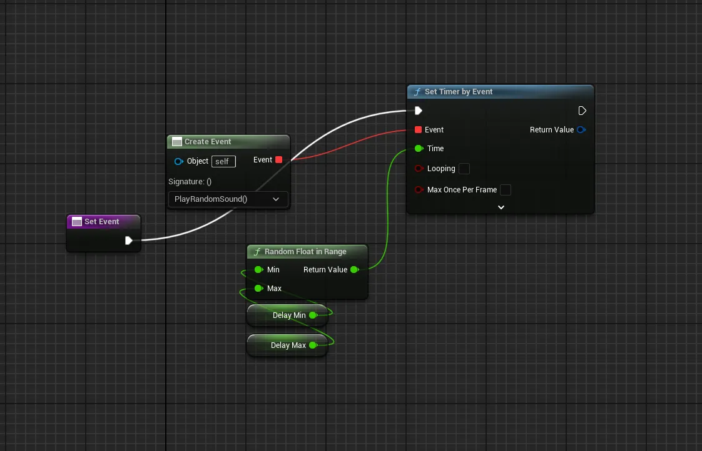

Once triggered, it picks a random point within a predefined zone, also set up in the editor, where we can define the radius.

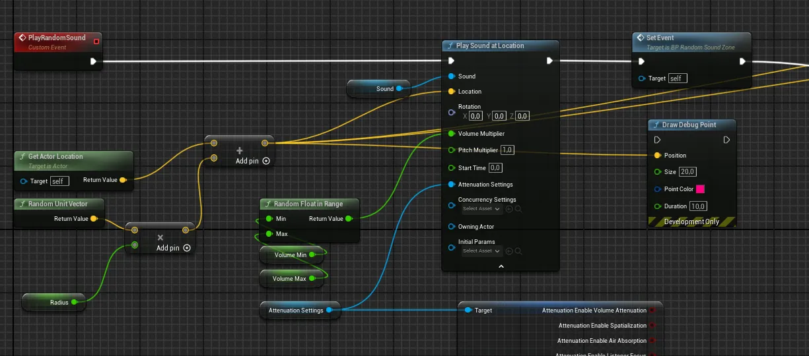

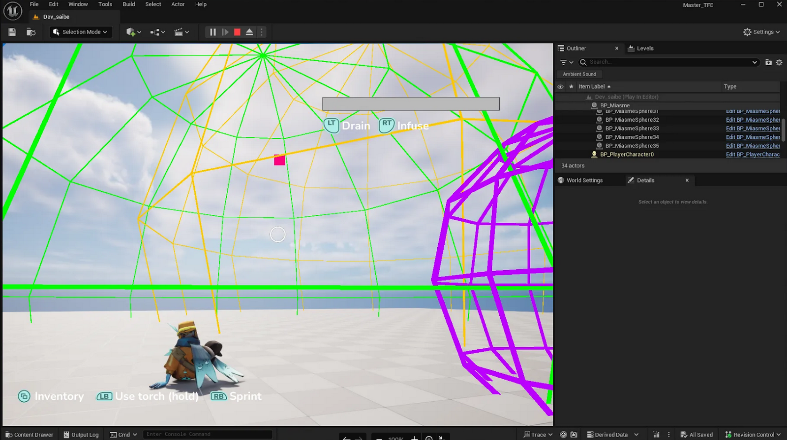

## End Cutscene & Trailer

### Cutscene

<iframe width="560" height="315" src="https://www.youtube.com/embed/ajTqqzeL2ok?si=KDOt711QJEwnhoBs" title="YouTube video player" frameborder="0" allow="accelerometer; autoplay; clipboard-write; encrypted-media; gyroscope; picture-in-picture; web-share" referrerpolicy="strict-origin-when-cross-origin" allowfullscreen></iframe>

The ending cutscene was created entirely in Unreal Engine using the Video Sequencer, while the sound design was completed in Premiere Pro.

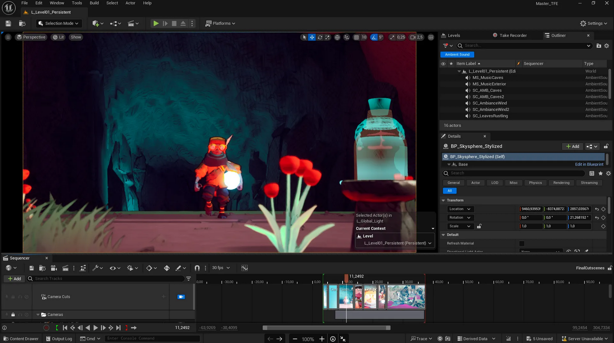

### Trailer

<iframe width="560" height="315" src="https://www.youtube.com/embed/65jF9kK9jLU?si=_wVtdJQgO7L7HHjy" title="YouTube video player" frameborder="0" allow="accelerometer; autoplay; clipboard-write; encrypted-media; gyroscope; picture-in-picture; web-share" referrerpolicy="strict-origin-when-cross-origin" allowfullscreen></iframe>

The trailer was also made using Unreal’s Video Sequencer and Premiere Pro. It combines staged shots with gameplay footage captured with OBS.

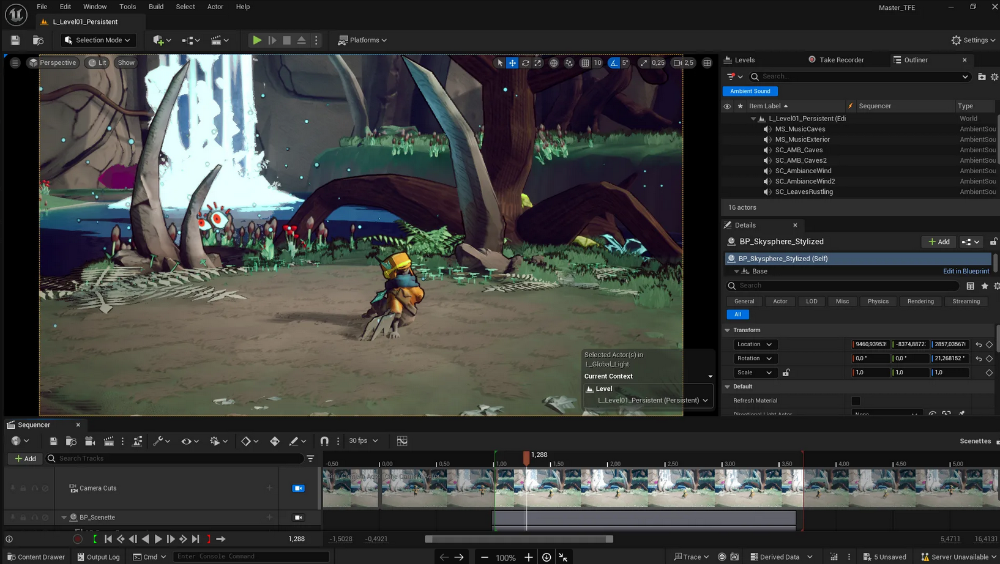

## Team Members
