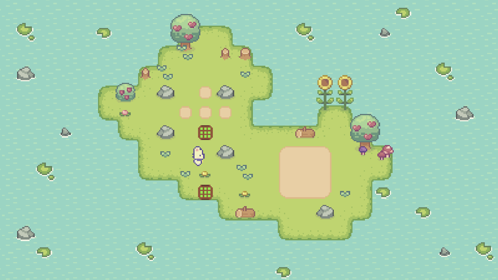
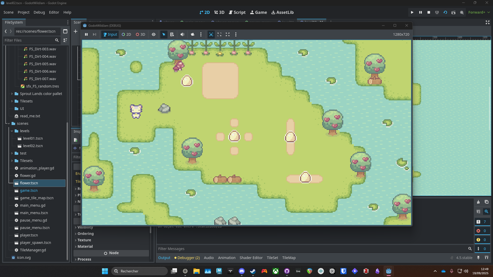

---

title : "Soko-Garden"
date : 2025-09-22
showHero : true
draft : false
showTableOfContents : true
heroStyle : "background"
summary : "Make your flowers grow and create a beautiful garden in this Sokoban-inspired game."
categories: ["Game Design", "Sound Design", "Game Jam"]
---

  <h3>Game-Jam Entry : Soko-Garden</h3>
  

    <em>Make your flowers grow and create a beautiful garden in this Sokoban-inspired game made for Wild Jam #85 (theme: Expansion).</em>
  

  <a href="https://toncopainsaibe.itch.io/soko-garden" target="_blank" 
     style="color:#1a73e8; text-decoration:none; font-weight:bold;">
     → Try it on itch.io :) 
  </a>

## Context

For Wild Jam #85, we challenged ourselves to learn game development with Godot 4.5.
We only had about three days to work on the project and used a free asset pack for the game’s visuals.

The theme of the jam was “Expansion.”

At first, we weren’t very inspired, but then the idea came: make flowers grow.
With the limited time and the challenge of learning a new engine (being more familiar with Unity and Unreal), we focused on keeping the concept achievable.

Both of us worked on the game design and programming.

## Game Design

Since this was a game jam, the design process was intentionally light. We brainstormed the concept together and iterated on the mechanics while implementing them.

One of our main discussions was whether to use a grid-based movement system. The goal was not to create a challenging Sokoban-like game, so the character’s movement was designed to be free. However, for the pushed objects, we restricted them to a grid to ensure the puzzles worked as intended.

I also designed and implemented the levels.

## Programming

As this was my first experience with programming, I couldn’t contribute to the more complex systems, but I still helped with:

- Integrating the character animations (from the asset pack)

- Implementing character movement

- Beginning the integration of sound design
